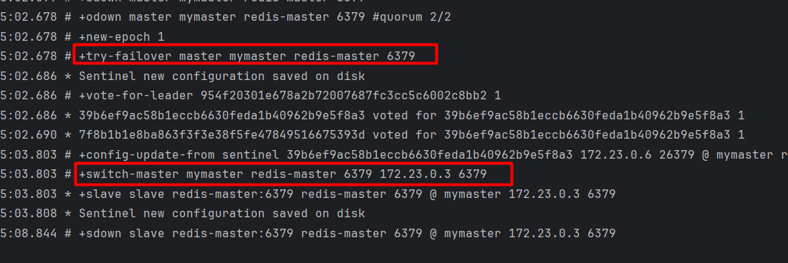
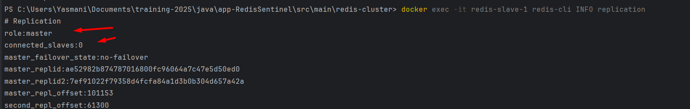
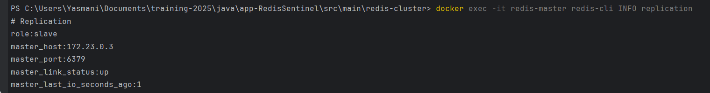
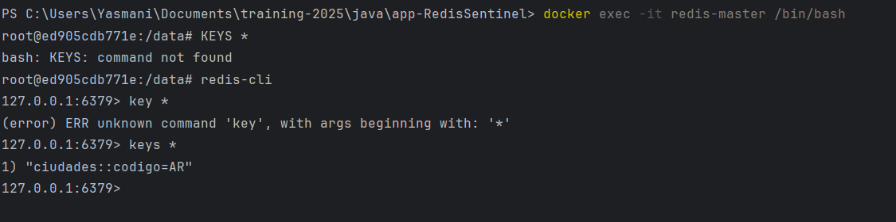

### Ver log instance
docker exec -it redis-master redis-cli INFO replication
docker exec -it redis-slave-2 redis-cli INFO replication

# Ver estado de sentinel
docker exec -it sentinel-1 redis-cli INFO replication
docker exec -it redis-slave-2 redis-cli INFO replication

## Revisar log
docker logs sentinel-1

### Revisar Nodo Sentinel
docker exec -it sentinel-2 redis-cli -p 26379 SENTINEL get-master-addr-by-name mymaster

### Haciendo ping
docker exec -it redis-master redis-cli -h redis-slave-1 -p 6379 ping
docker exec -it sentinel-1 redis-cli -p 26379 sentinel sentinels mymaster

#### Testing failover
docker exec redis-master redis-cli info replication
docker exec redis-slave-1 redis-cli info replication

docker exec sentinel-1 redis-cli -p 26379 sentinel master mymaster
docker exec sentinel-1 redis-cli -p 26379 sentinel slaves mymaster

Simulamos falla
docker stop redis-master

Observar

docker logs sentinel-1
docker logs sentinel-2
docker logs sentinel-3

Verifica el nuevo maestro
docker exec sentinel-1 redis-cli -p 26379 sentinel master mymaster

Verificar la replicacion
docker exec redis-slave-1 redis-cli info replication

Verificacion nuevo rol
docker exec redis-master redis-cli info replication

## Pruebas de persistencia
1.- revisamos el esclavo
docker exec -it redis-slave1 redis-cli INFO replication

2.- revisamos log
docker logs -f sentinel-1
docker logs -f sentinel-2
docker logs -f sentinel-3

3.- Se verifica el sclave
docker exec -it redis-slave-1 redis-cli INFO replication

4.- Se retorna el maestro
docker unpause redis-master

5.- se verifica el maestro
docker exec -it redis-master redis-cli INFO replication

fin

##Se puede Verificar el cache usando

docker exec -it redis-master redis-cli -h redis-slave-1 -p 6379 ping

Tambien se puede verificar desde slave
docker exec -it redis-master redis-cli -h redis-slave-1 -p 6379

